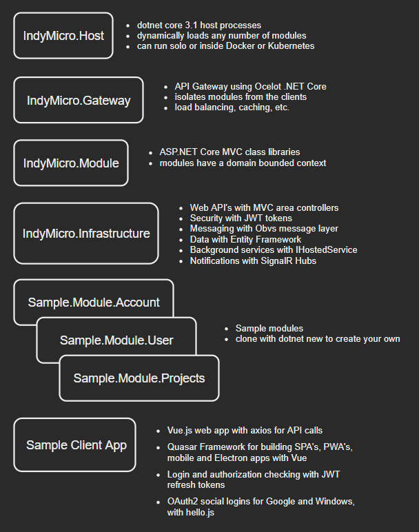

## Chapter 02

# Architecture

Before getting started it is helpful to take a look at the application architecture first.

 

### ASP.NET Core Framework

The ASP.NET Core framework provides a great way to separate your application into dynamically loadable project modules that can eventually grow into full microservices.  The key to making this work is to follow some guidelines to keep your modules isolated and separated from each other while you are in the monolithic growth stage of your application.  Over time, if you maintain this separation, you can split your monolith and deploy groups of modules into separate hosts that can then scale separately in terms of resources like high CPU or memory or bandwidth needs.  

IndyMicro.NET uses the following features of ASP.NET Core:

- HostBuilder
- Configuration
- Logging
- Dependency Injection
- Web API's with MVC
- Swagger API documentation
- Authentication with JWT's
- Authorization policies using claims and roles
- Razor page support (mostly for admin and monitoring)
- SignalR for realtime client messaging
- Entity Framework code first storage per module
- Hosted background services per module

### Additional Infrastructure Libraries

In addition to ASP.NET, the following libraries add key features:

- [Obvs](https://github.com/christopherread/Obvs):  a message bus service adapter used either in-process or distributed
- [Ocelot](https://github.com/ThreeMammals/Ocelot):  an API Gateway to provide a backend for frontend interface
- [Azure SignalR](https://azure.microsoft.com/en-us/services/signalr-service/): for distributed web socket client notifications
- [IDistributedCache](https://docs.microsoft.com/en-us/aspnet/core/performance/caching/distributed?view=aspnetcore-3.1):  a memory service adapter for using [Redis](https://docs.microsoft.com/en-us/rest/api/redis/redis) or [NCache](https://github.com/Alachisoft/NCache)

### Front End Stacks

A sample front end stack is provided that you can clone or learn from.

- [Vue.js](https://vuejs.org/) with axios for API calls
- [Quasar Framework](https://quasar.dev/) for building SPA's, PWA's, mobile and Electron apps with Vue.js
- Login and authorization checking with [JWT](https://jwt.io/) refresh tokens
- OAuth2 social logins for Google and Windows, with [hello.js](https://adodson.com/hello.js/)

[< Back](index.md)

